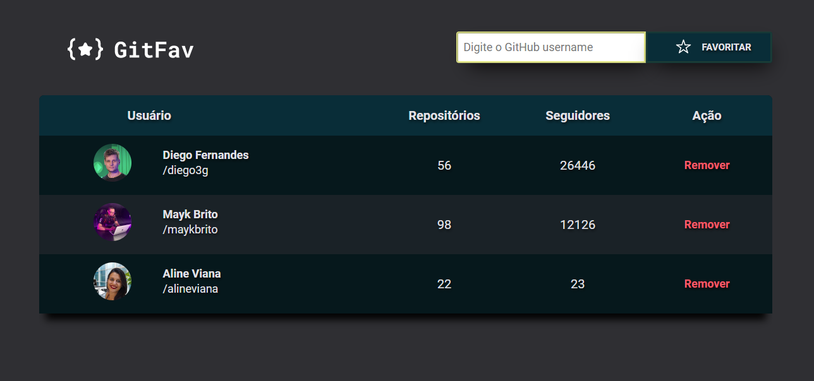
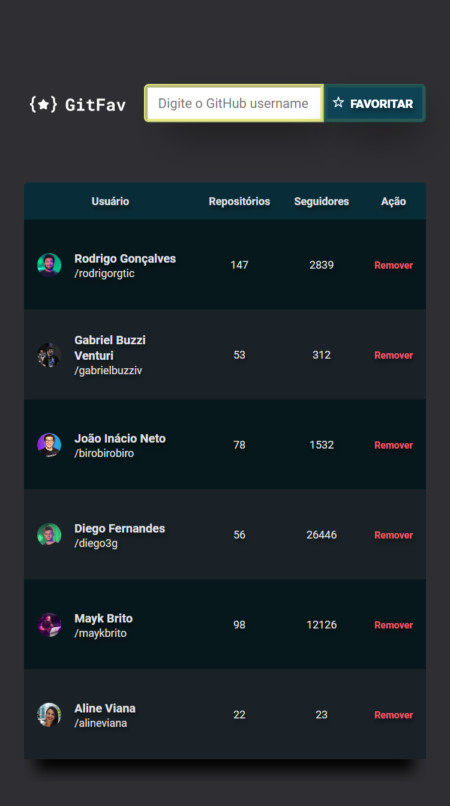

# GitFav | Projeto 11 - Programa Explorer da Rocketseat

- Desenvolvendo uma aplicação para marcação dos favoritos do GitHub.

 

Clique [AQUI](https://alineviana.github.io/github-favorites/) para acessar o projeto

 

> ## 📝 Conceitos estudados 
 

- Construindo tabelas no HTML
- Definindo acessibilidade com Screen Reader Only
- Conceitos da POO
- Classes
- Herança
- Polimorfismo
- Criando HTML com JavaScript
- Imutabilidade para trabalhar com os dados da aplicação
- LocalStorage
- Métodos estáticos e promessas
- Async Await
- Cuidando do fluxo da aplicação com try, catch, throw
- API
- fetch()
- Desestruturação no JavaScript
- Método filter()

 

> ## 🖥️ Tecnologias
 

- HTML5
- CSS3
- JavaScript